# 第二部分：高级学习算法

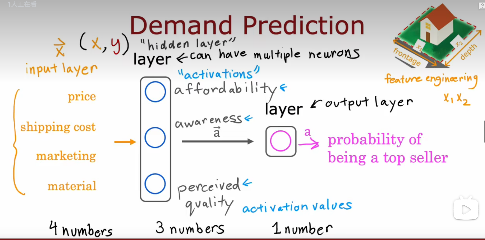

神经网络基本的结构：输入层，隐藏层，输出层，这个例子中从隐藏层到输出层实际上是逻辑回归，判断房子成为最畅销的概率

多层隐藏层：多层感知器

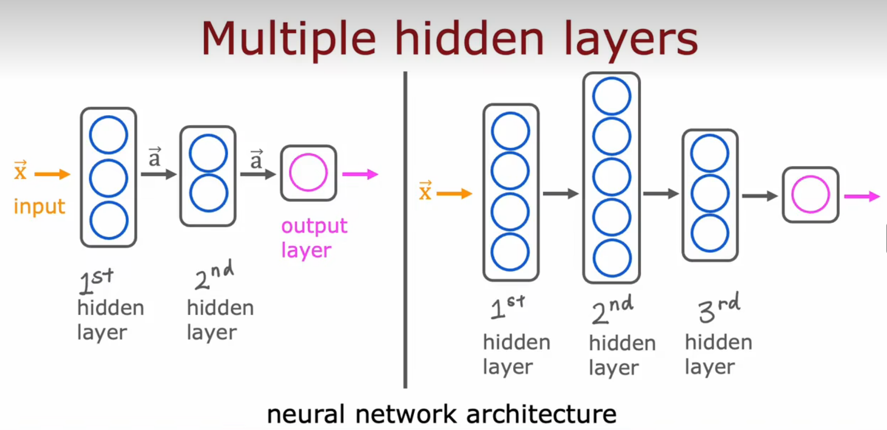

例子：

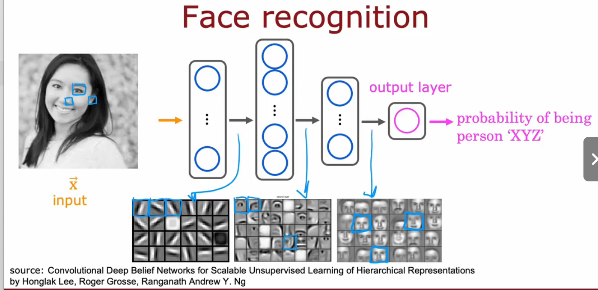

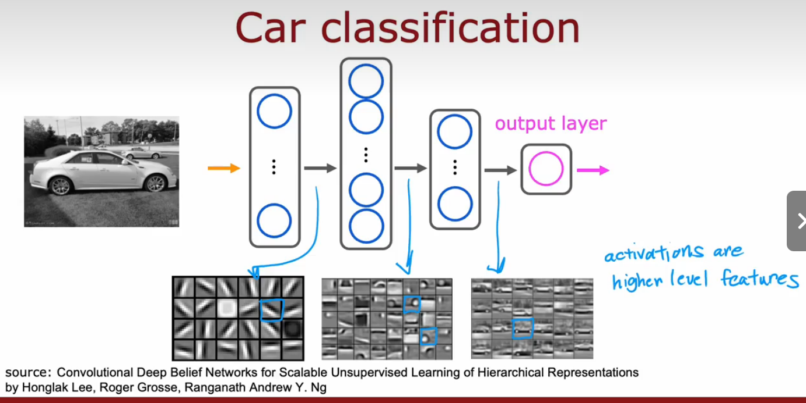

不同的隐藏层可视化后可以发现它们在试图检测从细节到全局的图像特征，神经网络可以自己调整隐藏层来达到识别的目的，这也是神经网络的工作原理。

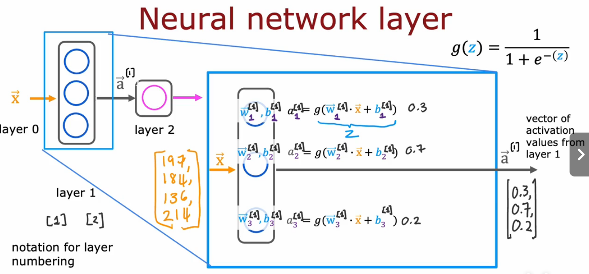

右上角的[1]表示这是第1层隐藏层，右下角的1，2表示这是这层隐藏层的第几个神经元的参数

工作原理：每个层都输入一个数字向量，并对其应用一系列逻辑回归单元， 然后计算另一个 数字向量，然后从一个层传递到另一个层，直到进入最终的输出层计算， 即神经网络的预测。 

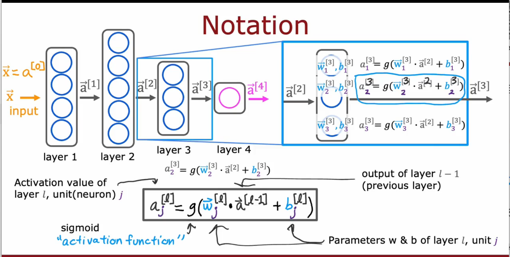

​                                                                                                     各个参数的符号表示

forward propagation正向传播，从左到右进行计算，与反向传播相对；这种类型的神经网络架构，刚开始的隐藏层每层有比较多的隐藏单元，当靠近输出层时，隐藏单元的数量就会减少

TensorFlow和numpy都是常用的库，两者在使用上有不同之处，可以互相转换

TensorFlow中构建模型：

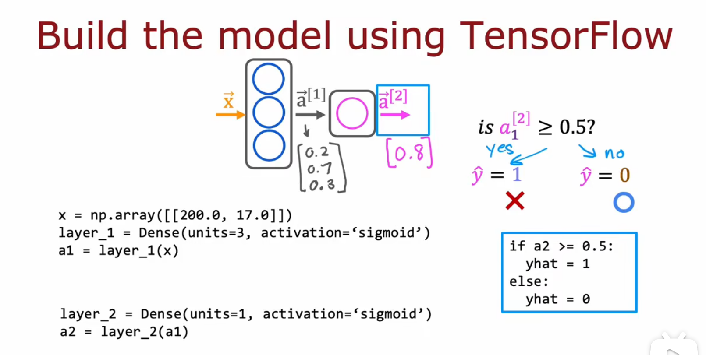

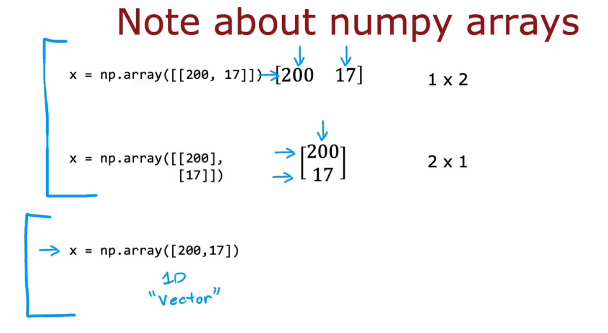

第一个是一个1×2矩阵，每一行是二维向量，第二个是2×1矩阵，每一行是一维向量。第三个不是矩阵，是一维向量

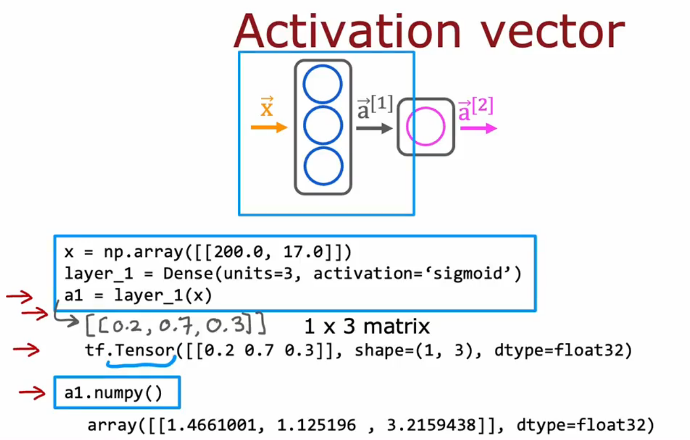

tf.Tensor()是TensorFlow中矩阵的表示方式，array()是Numpy中矩阵的表示方式

TensorFlow中创建模型也可简化成如下：

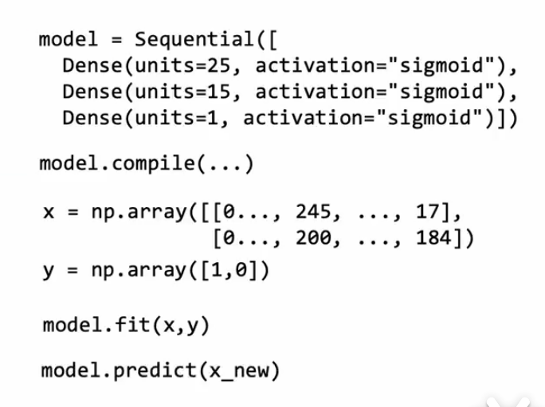

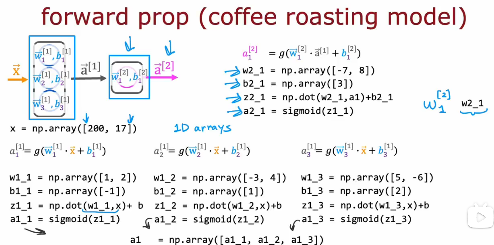

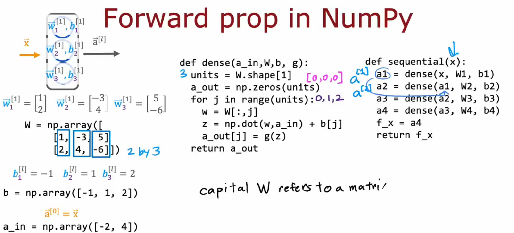

矩阵乘法：
左边是传统的矩阵乘法计算方式，右边是直接使用Numpy进行矩阵运算

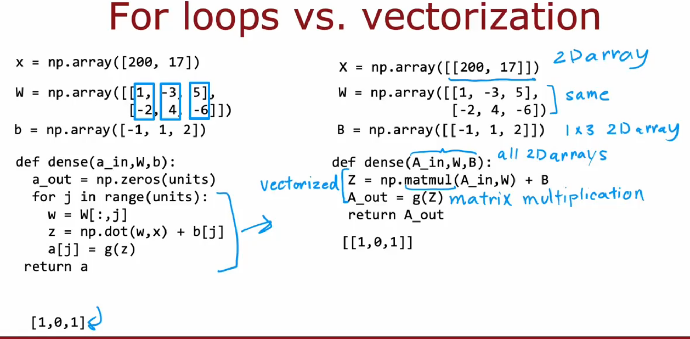